# 功能分解圖文檔（Functional Decomposition Diagram）

> **版本**：v1.0  
> **基於**：ORCA 分析文檔與產品需求文件  
> **目的**：將系統功能從高層到低層逐步分解，清晰展示功能模組與層次關係，協助規劃開發範圍與溝通對齊

---

## FDD 說明

功能分解圖（Functional Decomposition Diagram, FDD）是一種將系統功能從高層到低層逐步分解的層次化圖表，用於：

- **理解系統架構**：清晰展示系統的功能模組與層次關係
- **規劃開發範圍**：識別功能模組的優先級與開發順序
- **溝通對齊**：幫助設計師與工程師理解功能結構與依賴關係

**閱讀方式**：
- **Level 0**：系統整體
- **Level 1**：主要功能模組（10 個核心功能區塊）
- **Level 2**：子功能（每個模組下的具體功能）
- **Level 3**：具體操作步驟（僅關鍵功能展開）

---

## 完整功能分解圖

```mermaid
flowchart TD
    System[節慶互助平台系統] --> Auth[認證系統]
    System --> Rescue[救援功能 B1]
    System --> Helper[Helper 功能 B4]
    System --> Dashboard[個人儀表板]
    System --> Notification[通知系統 B7]
    System --> ResponseKit[應對錦囊 B2]
    System --> Venting[取暖牆 B5]
    System --> Diagnostic[角色診斷 B3]
    System --> LiveMap[實況地圖 B6]
    System --> Boundary[邊界說明書 B8]
    
    Auth --> Login[登入]
    Auth --> Register[註冊]
    Auth --> Profile[個人資料管理]
    
    Rescue --> CreateRequest[建立救援請求]
    Rescue --> ViewRequest[查看救援請求詳情]
    Rescue --> ManageRequest[救援請求管理]
    CreateRequest --> SelectType[選擇請求類型]
    CreateRequest --> SetStressLevel[設定壓力等級]
    CreateRequest --> SetBudget[輸入預算與描述]
    CreateRequest --> SetLocation[選擇地理位置]
    ViewRequest --> ViewStatus[查看請求狀態]
    ViewRequest --> ViewHelper[查看匹配 Helper]
    ViewRequest --> ViewMap[查看地圖位置]
    
    Helper --> RegisterHelper[Helper 註冊]
    Helper --> HelperProfile[Helper 檔案管理]
    Helper --> HelperDashboard[Helper 儀表板]
    Helper --> CaseManagement[接案管理]
    RegisterHelper --> InputBio[填寫個人簡介]
    RegisterHelper --> SelectSkills[選擇技能標籤]
    RegisterHelper --> SetRate[設定時薪]
    HelperDashboard --> ViewAvailable[查看可接案件]
    HelperDashboard --> ViewInProgress[查看進行中案件]
    HelperDashboard --> ViewHistory[查看歷史案件]
    HelperDashboard --> ViewStats[查看業績統計]
    
    Dashboard --> UserInfo[用戶資訊顯示]
    Dashboard --> QuickActions[快速操作]
    Dashboard --> DataIntegration[個人資料整合]
    QuickActions --> CreateRequestLink[建立請求]
    QuickActions --> CreateGatheringLink[發起聚會]
    QuickActions --> ResponseKitLink[應對錦囊]
    DataIntegration --> RescueRequests[救援請求列表]
    DataIntegration --> Gatherings[聚會列表]
    DataIntegration --> Notifications[通知列表]
    
    Notification --> ViewList[通知列表]
    Notification --> FilterNotifications[通知篩選]
    Notification --> ManageStatus[通知狀態管理]
    FilterNotifications --> FilterAll[全部]
    FilterNotifications --> FilterUnread[未讀]
    FilterNotifications --> FilterRead[已讀]
    
    ResponseKit --> GenerateScript[腳本生成]
    ResponseKit --> DisplayScript[腳本顯示]
    ResponseKit --> SaveScript[腳本收藏]
    GenerateScript --> InputQuestion[輸入長輩問話]
    GenerateScript --> Generate[生成腳本]
    DisplayScript --> ViewContent[查看腳本內容]
    DisplayScript --> ViewBodyLanguage[查看肢體語言建議]
    
    Venting --> PostFlow[貼文流]
    Venting --> CreateGathering[發起聚會]
    Venting --> ManageGathering[聚會管理]
    PostFlow --> ViewPosts[顯示貼文]
    PostFlow --> CreatePost[發布貼文]
    PostFlow --> InteractPost[按讚與留言]
    CreateGathering --> SetGatheringInfo[設定聚會資訊]
    CreateGathering --> SetGatheringTime[設定時間地點]
    CreateGathering --> SetMaxParticipants[設定人數上限]
    ManageGathering --> ViewGatheringDetails[查看聚會詳情]
    ManageGathering --> ViewParticipants[查看參與者]
    ManageGathering --> ViewGatheringMap[查看地圖位置]
    
    Diagnostic --> StartTest[開始測驗]
    Diagnostic --> SubmitAnswers[提交答案]
    Diagnostic --> ViewReport[診斷報告]
    StartTest --> SelectTestType[選擇測驗類型]
    ViewReport --> ViewShadowArea[查看心理陰影面積]
    ViewReport --> ViewSocialLabel[查看社交標籤]
    ViewReport --> ViewPrescription[查看處方箋]
    
    LiveMap --> MapVisualization[地圖視覺化]
    LiveMap --> ToggleLayers[圖層切換]
    LiveMap --> MapMarkers[地圖標記]
    MapVisualization --> ViewRescuePoints[顯示救援點]
    MapVisualization --> ViewHelperLocations[顯示 Helper 位置]
    MapVisualization --> ViewSanctuaries[顯示避難空間]
    MapVisualization --> ViewLonerCoords[顯示自由人座標]
    MapVisualization --> ViewHeatMap[顯示熱力分布]
    
    Boundary --> EditBoundary[編輯邊界]
    Boundary --> ShareBoundary[分享功能]
    EditBoundary --> SetAcceptedTopics[設定接受話題]
    EditBoundary --> SetRejectedTopics[設定不接受話題]
    ShareBoundary --> GenerateShareLink[生成分享連結]
    ShareBoundary --> ShareToContacts[分享給親友]
    
    style System fill:#e1f5ff
    style Auth fill:#fff4e1
    style Rescue fill:#ffe1e1
    style Helper fill:#e1ffe1
    style Dashboard fill:#f0e1ff
    style Notification fill:#ffe1f0
    style ResponseKit fill:#e1ffff
    style Venting fill:#ffffe1
    style Diagnostic fill:#e1e1ff
    style LiveMap fill:#ffe1ff
    style Boundary fill:#e1ffe1
```

---

## 功能模組對照表

> **「相關板塊」欄位說明**：
> - **B1-B8**：表示該功能模組屬於對應的業務板塊（如 B1 避難中心、B2 應對錦囊等）
> - **-**：表示該功能模組是「基礎設施功能」或「整合性功能」，不屬於特定業務板塊
>   - **基礎設施功能**：如認證系統、個人資料管理，為所有板塊提供基礎服務
>   - **整合性功能**：如個人儀表板，整合多個板塊的資訊，不屬於單一板塊

| 功能模組 | 英文代碼 | 優先級 | 相關板塊 | 狀態 | 主要子功能 |
|---------|---------|--------|---------|------|-----------|
| **認證系統** | Authentication | P0 | - | Phase 1 | 登入、註冊 |
| **救援功能** | Rescue | P0 | B1 | Phase 1 | 建立請求、查看詳情 |
| **Helper 功能** | Helper | P0 | B4 | Phase 1 | Helper 註冊、儀表板、接案管理 |
| **個人儀表板** | Dashboard | P0 | - | Phase 1 | 用戶資訊、快速操作（簡化版） |
| **通知系統** | Notification | P0 | B7 | Phase 1 | 通知列表、篩選 |
| **個人儀表板擴展** | Dashboard Extended | P1 | - | Phase 2 | 救援請求列表、聚會列表 |
| **個人資料管理** | Profile | P1 | - | Phase 2 | 個人資料設定 |
| **通知系統擴展** | Notification Extended | P1 | B7 | Phase 2 | 通知設定 |
| **救援功能擴展** | Rescue Extended | P1 | B1 | Phase 2 | 選擇 Helper |
| **Helper 功能擴展** | Helper Extended | P1 | B4 | Phase 2 | Helper 檔案、Helper 設定 |
| **應對錦囊** | Response Kit | P1 | B2 | Phase 2 | 腳本生成、顯示、收藏 |
| **取暖牆** | Venting | P1 | B5 | Phase 2 | 貼文流、發起聚會、聚會管理 |
| **角色診斷** | Diagnostic | P2 | B3 | Phase 3 | 開始測驗、提交答案、診斷報告 |
| **實況地圖** | Live Map | P2 | B6 | Phase 3 | 地圖視覺化、圖層切換、地圖標記 |
| **邊界說明書** | Boundary Manual | P2 | B8 | Phase 4 | 編輯邊界、分享功能 |

---

## 功能層次說明

### Level 1：主要功能模組

系統的核心功能區塊，每個模組代表一個獨立的業務領域。

### Level 2：子功能

每個功能模組下的具體功能點，對應到用戶可執行的操作。

### Level 3：具體操作步驟

關鍵功能的詳細操作流程，僅在需要時展開（如建立救援請求的完整步驟）。

