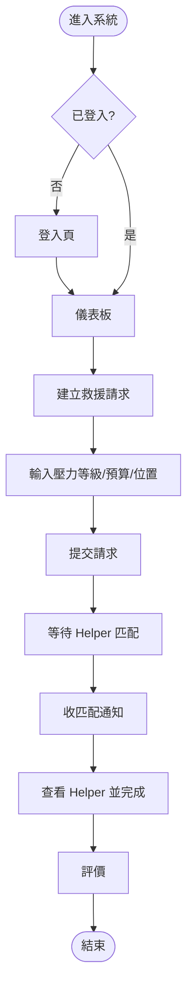
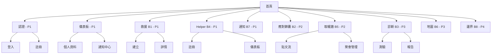

# 產品需求文件 (PRD) v1.0

> **版本**：v1.0 | **建立日期**：2025
> **目標讀者**：UIUX 設計師、PM、前端/後端工程師
> **文檔目的**：定義 ORCA 產品需求、設計規格與技術架構，平衡設計美感與工程實作。

---

## 1. 背景簡介與目標

### 產品定位：**節慶互助平台 - ORCA**
協助用戶應對節慶期間的社交壓力，提供救援、工具、社群連結與自我診斷。

### 目標用戶與核心功能
| 角色 | 英文名稱 | 主要需求 | 核心功能 |
| :--- | :--- | :--- | :--- |
| 焦慮求助者 | Escapee | 即時救援、應對技巧 | 救援請求、應對錦囊、角色診斷 |
| 專業閒人 | Helper | 提供救援服務賺取收益 | Helper 註冊、接案管理、業績統計 |
| 覺醒長輩 | WokeElder | 了解溝通邊界 | 角色診斷、邊界說明書 |
| 夾心配偶 | SilentBuffer | 社交緩衝與取暖 | 救援請求、取暖牆、應對錦囊 |
| 節慶自由人 | UrbanLoner | 尋找同溫層聚會 | 發起/參與聚會、取暖牆 |

### 產品階段 (Phase)
- **Phase 1 (MVP)**：驗證核心救援功能與 Helper 匹配機制。
- **Phase 2**：擴展核心功能 (取暖牆、應對錦囊)。
- **Phase 3**：增加診斷工具 (角色診斷) 與實況地圖。
- **Phase 4**：個人社交邊界管理 (邊界說明書)。

---

## 2. 功能清單與分解 (FDD)

### 功能模組概覽
1. **認證系統 (Auth)**：登入、註冊 (Phase 1)。
2. **救援功能 (Rescue, B1)**：建立/管理救援請求、Helper 匹配 (Phase 1/2)。
3. **Helper 功能 (Helper, B4)**：Helper 註冊、儀表板、接案 (Phase 1/2)。
4. **儀表板 (Dashboard)**：用戶資訊、快速操作、資料整合 (Phase 1/2)。
5. **通知系統 (Notify, B7)**：列表、篩選、狀態管理 (Phase 1/2)。
6. **應對錦囊 (Response, B2)**：腳本生成、收藏 (Phase 2)。
7. **取暖牆 (Venting, B5)**：貼文、聚會管理 (Phase 2)。
8. **角色診斷 (Diag, B3)**：心理測驗、診斷報告 (Phase 3)。
9. **實況地圖 (Map, B6)**：視覺化標記、圖層切換 (Phase 3)。
10. **邊界說明書 (Boundary, B8)**：編輯/分享邊界 (Phase 4)。

> 詳細子功能請見 [feature-list.md](./feature-list.md) 與 [functional-decomposition.md](./functional-decomposition.md)。

---

## 3. 功能流程圖 (User Flows)

### 核心流程範例：Escapee 建立救援請求

### 主要角色路由
- **Escapee**: `/rescue-request/create` (P0) | `/response-kit` (P1)
- **Helper**: `/helper/register` -> `/helper/dashboard` (P0)
- **UrbanLoner**: `/venting` -> `/gathering/create` (P1)
- **WokeElder**: `/diagnostic` -> `/boundary-manual` (P2)

---

## 4. 資訊架構 (Site Map)

---

## 5. 設計與技術規格

### UI 設計規範
- **布局模板**：表單、詳情、儀表板、列表 (4 種)。
- **響應式**：Mobile (<768px), Tablet (768-1024px), Desktop (>1024px)。
- **組件**：基於設計系統的基礎組件 (Button/Card) 與業務組件 (HelperCard)。

### 技術工程規格
- **路由**：使用 `kebab-case`，守衛機制 (Auth/Role/Owner)。
- **資料複雜度**：
    - **Simple**: 1:1 資料來源 (登入)。
    - **Standard**: 1:2-3 資料來源 (請求詳情)。
    - **Complex**: 1:N 聚合資料 (儀表板)。
- **開發框架**：Nuxt 3, Hooks 命名規範 `use[Context][Resource]`。

---

## 6. MVP 決策與驗收

### 核心決策
- **匹配機制**：Phase 1 採一對一自動匹配，由 User 與 Helper 構成簡單關係。
- **應對腳本**：MVP 階段使用預定義腳本，不依賴即時 AI 生成。
- **分享機制**：診斷報告採 token 式私密連結分享。

### 驗收標準 (AC)
1. **功能**：符合 Phase 1-4 定義之業務邏輯 (如成功註冊、發送請求)。
2. **設計**：符合響應式斷點、組件狀態 (Loading/Error) 與視覺層級。
3. **技術**：符合 BFF 路徑規範、TypeScript 介面定義與資料載入策略。

---

## 7. 文檔索引與追蹤
- **文檔**：[Feature List](./feature-list.md), [User Flows](./user-flows.md), [Tech Specs](./technical-specs.md)
- **修訂**：v1.0 (2025) 初始版本建立。

---
**最後更新**：2025 | **維護者**：待指定

