# 用戶流程圖文檔

---

## 流程圖說明

- **矩形**：頁面/操作
- **菱形**：決策點
- **圓角矩形**：系統處理
- **標註**：頁面路由與 BFF 路徑

---

## Escapee（焦慮的求助者）流程

### 流程 1：建立救援請求

```mermaid
flowchart TD
    Start([進入系統]) --> Login{已登入}
    Login -->|否| LoginPage[登入頁面]
    LoginPage --> Dashboard[個人儀表板]
    Login -->|是| Dashboard
    Dashboard --> CreateRequest[建立救援請求頁面]
    CreateRequest --> InputInfo[輸入壓力等級與預算]
    InputInfo --> SetLocation[設定地理位置]
    SetLocation --> Submit[提交請求]
    Submit --> BFF1[POST api rescue request create]
    BFF1 --> RequestCreated[請求已建立]
    RequestCreated --> ViewRequest[救援請求詳情頁面]
    ViewRequest --> BFF2[GET api rescue request id details]
    BFF2 --> WaitMatch[等待匹配]
    WaitMatch --> MatchNotification[收到匹配通知]
    MatchNotification --> BFF3[GET api notifications list]
    BFF3 --> ViewMatches[選擇 Helper 頁面]
    ViewMatches --> BFF4[GET api helper list]
    BFF4 --> SelectHelper[選擇 Helper]
    SelectHelper --> AcceptMatch[接受匹配]
    AcceptMatch --> BFF5[POST api rescue request id accept match]
    BFF5 --> Matched[匹配成功]
    Matched --> Complete[完成救援]
    Complete --> Rate[評價 Helper]
    Rate --> BFF6[POST api rescue request id rate]
    BFF6 --> End([流程結束])
```

### 流程 2：使用應對錦囊

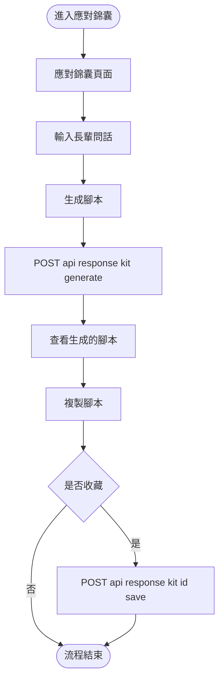

### 流程 3：進行角色診斷

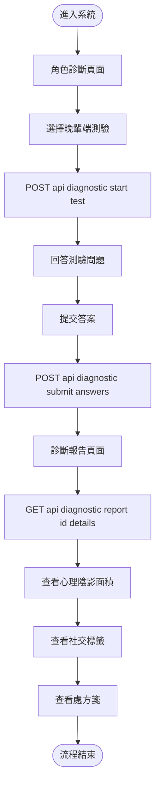

---

## Helper（專業的閒人）流程

### 流程 1：註冊成為 Helper 並接案

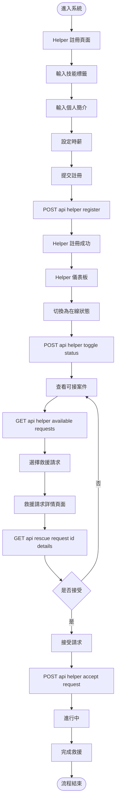

---

## WokeElder（覺醒的長輩）流程

### 流程 1：進行角色診斷

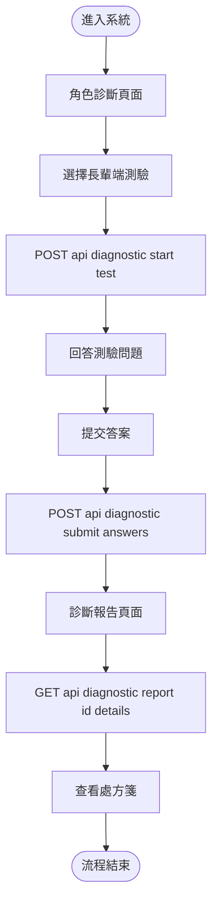

### 流程 2：查看邊界說明書

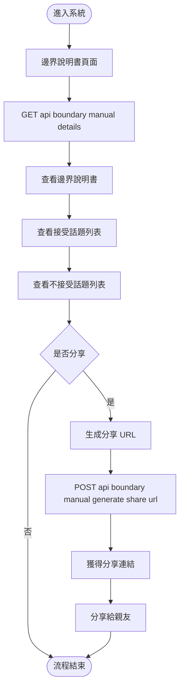

---

## SilentBuffer（夾心餅乾配偶）流程

### 流程 1：建立救援請求並使用應對腳本

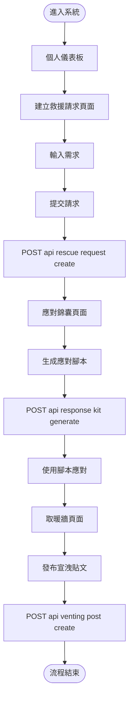

### 流程 2：取暖牆宣洩貼文

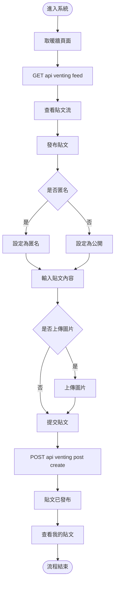

---

## UrbanLoner（節慶邊緣人）流程

### 流程 1：發起聚會並參與社群

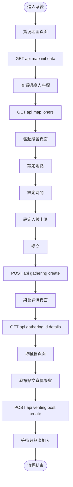

### 流程 2：參與他人發起的聚會

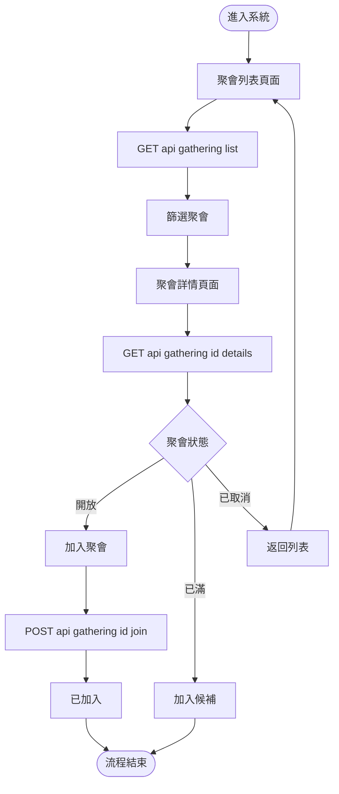

### 流程 3：查看實況地圖

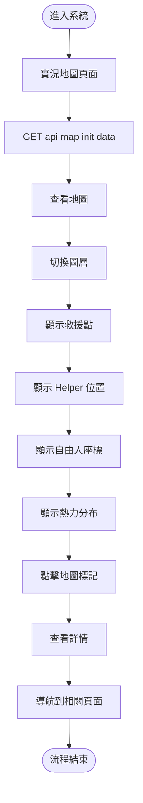

---

## 跨角色通用流程

### 流程 1：查看通知

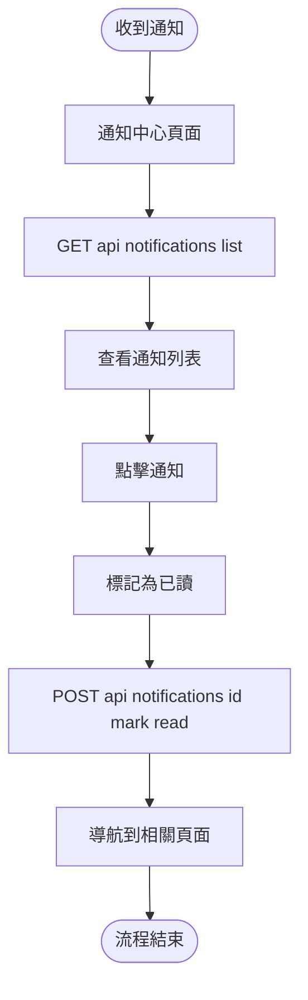

### 流程 2：建立邊界說明書

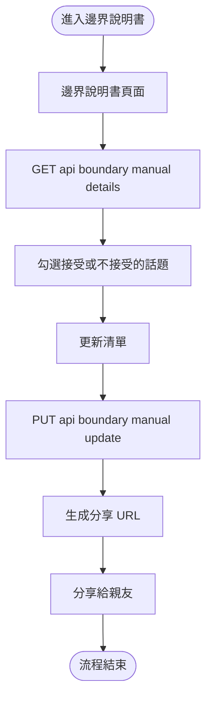

---

## 流程圖對應表

| 用戶角色 | 主要流程 | 頁面路由 | BFF 路徑 | Phase |
|---------|---------|---------|----------|-------|
| Escapee | 建立救援請求 | `/rescue-request/create` | `POST /api/rescue-request/create` | Phase 1 |
| Escapee | 使用應對錦囊 | `/response-kit` | `POST /api/response-kit/generate` | Phase 2 |
| Escapee | 角色診斷 | `/diagnostic` | `POST /api/diagnostic/start-test` | Phase 3 |
| Helper | 註冊並接案 | `/helper/register` | `POST /api/helper/register` | Phase 1 |
| Helper | 查看可接案件 | `/helper/dashboard` | `GET /api/helper/available-requests` | Phase 1 |
| WokeElder | 角色診斷 | `/diagnostic` | `POST /api/diagnostic/start-test` | Phase 3 |
| WokeElder | 查看邊界說明書 | `/boundary-manual` | `GET /api/boundary-manual/details` | Phase 4 |
| SilentBuffer | 建立請求+腳本 | `/rescue-request/create` + `/response-kit` | 多個 BFF 路徑 | Phase 1/2 |
| SilentBuffer | 取暖牆宣洩貼文 | `/venting` | `POST /api/venting/post/create` | Phase 2 |
| UrbanLoner | 發起聚會 | `/gathering/create` | `POST /api/gathering/create` | Phase 2 |
| UrbanLoner | 參與聚會 | `/gathering/list` | `GET /api/gathering/list` | Phase 2 |
| UrbanLoner | 查看實況地圖 | `/map` | `GET /api/map/init-data` | Phase 3 |
| 所有角色 | 查看通知 | `/notifications` | `GET /api/notifications/list` | Phase 1 |
| 所有角色 | 建立邊界說明書 | `/boundary-manual` | `PUT /api/boundary-manual/update` | Phase 4 |

---

## 決策點說明

### 1. 登入狀態檢查
- **位置**：所有需要認證的流程
- **決策**：已登入 → 繼續流程；未登入 → 導向登入頁

### 2. 匹配選擇
- **位置**：救援請求匹配流程
- **決策**：接受匹配 → 繼續；拒絕 → 重新匹配

### 3. 聚會狀態檢查
- **位置**：參與聚會流程
- **決策**：開放 → 加入；已滿 → 候補；已取消 → 返回

### 4. 收藏選擇
- **位置**：應對腳本流程
- **決策**：收藏 → 保存；不收藏 → 僅使用

---

## 錯誤處理流程

### 流程：處理 API 錯誤

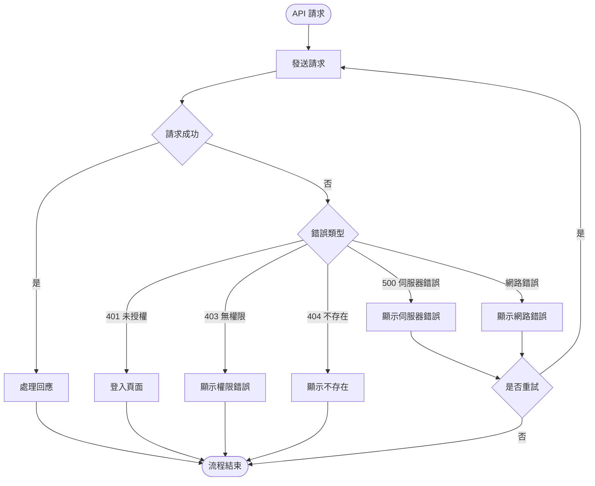

---

## 流程優化建議

### 1. 減少步驟
- 合併相關操作（如建立請求後直接進入匹配頁）
- 提供快速操作入口（FAB 按鈕）

### 2. 提供預設值
- 地理位置自動偵測
- 預設技能標籤建議
- 預設語氣選擇

### 3. 即時反饋
- 載入狀態顯示（Skeleton）
- 操作成功提示
- 錯誤訊息明確

### 4. 離線支援
- 快取常用資料
- 離線時顯示快取內容
- 上線後同步更新

---

**文檔版本**：v1.0  
**最後更新**：2024  
**維護者**：待指定

