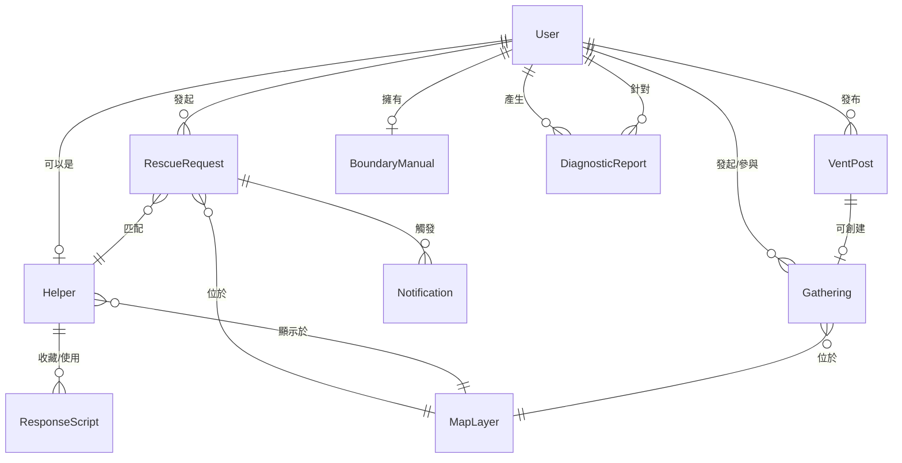

# 🎭 節慶互助平台 - ORCA 分析文檔 v1.2

> **版本說明**：第一代 ORCA 分析，基於 blue-print 的初步對象識別與關係定義，已完成 MVP 階段決策確認  
> **建立日期**：2024  
> **狀態**：MVP 決策已確認 - 可進入下一階段設計  
> **注意**：此關係圖用於理解業務邏輯，實際資料庫設計由後端團隊負責

---

## 📋 目錄

1. [Objects（對象）](#objects對象)
2. [Relationships（關係）](#relationships關係)
3. [Calls to Action（功能操作）](#calls-to-action功能操作)
4. [Attributes（屬性）](#attributes屬性)
5. [MVP 決策摘要](#mvp-決策摘要)

---

## Objects（對象）

### 核心對象清單

| 對象 | 來源 | 描述 | 相關板塊 | 核心類型/狀態 |
|------|------|------|----------|---------------|
| **User** | 5 個用戶角色 | 系統中所有角色的基礎對象 | 所有板塊 | `Escapee`, `Helper`, `WokeElder`, `SilentBuffer`, `UrbanLoner` |
| **RescueRequest** | B1 避難中心 | 用戶發起的即時救援需求 | B1, B4, B6, B7 | `人力請求`, `空間導航`, `混合` |
| **Helper** | B4 英雄榜 | 提供救援服務的專業閒人 | B1, B4, B6 | `online`, `offline`, `busy` |
| **ResponseScript** | B2 應對錦囊 | 對話腳本，用於應對長輩問話 | B2 | `humorous`, `cold`, `laid-back` |
| **DiagnosticReport** | B3 角色診斷 | 雙向心理測驗的結果報告 | B3 | `elder`, `junior` |
| **VentPost** | B5 取暖牆 | 用戶發布的匿名或公開宣洩內容 | B5 | 純文字、文字+圖片、直播 |
| **Gathering** | B5 取暖牆 | 邊緣人發起的節慶小聚活動 | B5, B6 | `open`, `full`, `completed`, `cancelled` |
| **MapLayer** | B6 戰況地圖 | 地圖上的各種可視化圖層 | B1, B4, B5, B6 | `rescue-point`, `helper`, `sanctuary`, `loner`, `heat-zone` |
| **Notification** | B7 Line 即時通 | 系統發送的各類通知訊息 | B7 | `rescue-matched`, `survival-check`, `gathering-invite`, `helper-request` |
| **BoundaryManual** | B8 提問說明書 | 用戶設定的個人社交邊界清單 | B8 | 接受/不接受話題列表 |

### MVP 限制說明

- **User → Helper**：一個 User 只能有一個 Helper 身份（MVP 階段）
- **RescueRequest → Helper**：一對一自動匹配（系統自動匹配，用戶無法選擇）
- **ResponseScript**：腳本由前端工程師或 API SERVER 提供（不依賴 AI 生成）

> **詳細決策說明**：見 [MVP 決策記錄](./mvp-decisions.md)

---

## Relationships（關係）

### 關係圖

### 關係類型摘要

#### 一對多關係（One-to-Many）
- **User → RescueRequest**：`userId`（外鍵）
- **User → VentPost**：`userId`（外鍵），`isAnonymous`（可匿名）
- **User → Gathering**：`creatorId`（外鍵），`participants[]`（多對多）
- **User → DiagnosticReport**：`userId`（外鍵）
- **Helper → ResponseScript**：`savedByUsers[]`（多對多）

#### 一對一關係（One-to-One）
- **User → Helper**：`userId`（外鍵），唯一關係（MVP 限制）
- **User → BoundaryManual**：`userId`（外鍵），唯一

#### 多對多關係（Many-to-Many）
- **RescueRequest ↔ Helper**：`matchedHelperId`（外鍵），一對一自動匹配（MVP 決策）
- **Gathering ↔ User（參與者）**：`participants[]`（陣列）

> **詳細關係說明**：見 [MVP 決策記錄 - 決策 1-3](./mvp-decisions.md#對象層級決策)

---

## Calls to Action（功能操作）

### 核心操作摘要

| 對象 | 核心操作 | 描述 |
|------|----------|------|
| **User** | `register`, `login`, `updateProfile`, `switchRole`, `viewDashboard` | 用戶認證與基本操作 |
| **RescueRequest** | `createRequest`, `acceptMatch`, `cancelRequest`, `completeRequest`, `rateHelper` | 救援請求生命週期 |
| **Helper** | `registerAsHelper`, `toggleStatus`, `viewAvailableRequests`, `acceptRequest`, `viewHistory` | Helper 服務管理 |
| **ResponseScript** | `generateScript`, `selectTone`, `copyScript`, `saveScript` | 腳本生成與使用 |
| **DiagnosticReport** | `startTest`, `submitAnswers`, `viewReport`, `shareReport` | 診斷測驗流程 |
| **VentPost** | `createPost`, `uploadImages`, `setAnonymous`, `likePost`, `commentPost` | 貼文發布與互動 |
| **Gathering** | `createGathering`, `joinGathering`, `leaveGathering`, `cancelGathering` | 聚會管理 |
| **MapLayer** | `toggleLayer`, `viewHeatMap`, `clickMarker`, `navigateToLocation` | 地圖操作 |
| **Notification** | `receiveNotification`, `markAsRead`, `setNotificationPreferences` | 通知管理 |
| **BoundaryManual** | `createManual`, `generateShareUrl`, `shareManual`, `viewAccessStats` | 邊界說明書管理 |

> **完整操作列表**：詳細操作對應到 BFF 路徑設計，見 [`docs/bff-paths.md`](./bff-paths.md)

---

## Attributes（屬性）

> **完整定義**：見 [`types/orca-types.ts`](./types/orca-types.ts)

### 核心屬性摘要

| 對象 | 關鍵屬性 | 類型定義 | 說明 |
|------|----------|----------|------|
| **User** | `id`, `email`, `role`, `roles[]`, `location?` | `User`, `UserRole` | 用戶基本資訊與角色管理 |
| **RescueRequest** | `id`, `requestType`, `stressLevel`, `status`, `location`, `matchedHelperId?` | `RescueRequest` | 救援請求內容與匹配狀態 |
| **Helper** | `id`, `userId`, `skills[]`, `status`, `rating`, `ratingCount` | `Helper` | Helper 服務資訊與業績 |
| **ResponseScript** | `id`, `inputQuestion`, `tone`, `generatedScript`, `bodyLanguageTips[]` | `ResponseScript` | 腳本內容與語氣 |
| **DiagnosticReport** | `id`, `userId`, `testType`, `shadowArea`, `socialLabel`, `shareToken?` | `DiagnosticReport` | 診斷結果與分享 |
| **VentPost** | `id`, `userId`, `content`, `isAnonymous`, `location?`, `relatedGatheringId?` | `VentPost`, `Comment` | 貼文內容與關聯 |
| **Gathering** | `id`, `creatorId`, `title`, `scheduledAt`, `location`, `status`, `participants[]` | `Gathering` | 聚會資訊與參與者 |
| **MapLayer** | `id`, `type`, `coordinates`, `relatedObjectId`, `relatedObjectType` | `MapLayer` | 地圖圖層與關聯 |
| **Notification** | `id`, `userId`, `type`, `title`, `content`, `isRead`, `relatedObjectId?` | `Notification` | 通知內容與狀態 |
| **BoundaryManual** | `id`, `userId`, `shareToken`, `acceptedTopics[]`, `rejectedTopics[]` | `BoundaryManual` | 邊界清單與分享 |

### 共用類型

- **`Location`**：地理位置介面（`lat`, `lng`, `address?`）
- **`UserRole`**：用戶角色類型（`Escapee`, `Helper`, `WokeElder`, `SilentBuffer`, `UrbanLoner`）

> **完整 TypeScript 定義**：見 [`types/orca-types.ts`](./types/orca-types.ts)

---

## MVP 決策摘要

### 決策分類

| 分類 | 決策數量 | 關鍵決策 |
|------|----------|----------|
| **對象層級** | 3 | User-Helper 一對一、自動匹配、VentPost 可選關聯 |
| **關係層級** | 2 | MapLayer 視圖層、NotificationRule 機制 |
| **功能層級** | 2 | 腳本預先定義、私密連結分享 |
| **屬性層級** | 3 | 位置精確度差異化、匿名機制、Line 通知偏好 |
| **BFF 聚合** | 2 | 數據載入策略、頁面複雜度判斷 |

### 決策原則

> **決策原則**：優先選擇施工難度較低的方案，符合 MVP 快速迭代需求

### 完整決策記錄

> **詳細決策內容**：見 [MVP 決策記錄](./mvp-decisions.md)

**決策列表**：
1. User 與 Helper 一對一關係
2. RescueRequest 一對一自動匹配
3. Gathering 與 VentPost 可選關聯
4. MapLayer 為視圖層
5. NotificationRule 機制
6. ResponseScript 預先定義
7. 診斷報告私密連結分享
8. 地理位置精確度差異化
9. 匿名機制實作
10. Line 通知偏好設定
11. 數據載入策略
12. 頁面複雜度判斷

---

## 下一步行動

### 第一代迭代建議

1. **驗證對象完整性**
   - [ ] 與團隊討論是否遺漏重要對象
   - [ ] 確認對象命名是否符合業務邏輯

2. **細化關係定義**
   - [ ] 繪製完整的 ERD 圖
   - [ ] 確認外鍵與約束條件（與後端團隊對齊）

3. **優先級排序**
   - [ ] 標記 MVP 功能
   - [ ] 決定第一階段開發範圍

4. **BFF 設計準備**
   - [ ] 將 Calls to Action 對應到 BFF 路徑設計
   - [ ] 將 Attributes 對應到 BFF 回應格式
   - [ ] 與後端團隊確認聚合邏輯

---

## 相關文檔

- **類型定義**：[`types/orca-types.ts`](./types/orca-types.ts) - 完整 TypeScript 介面定義
- **決策記錄**：[`mvp-decisions.md`](./mvp-decisions.md) - MVP 階段完整決策記錄
- **BFF 設計**：[`bff-paths.md`](./bff-paths.md) - BFF 路徑設計與頁面複雜度分析
- **資料需求**：[`data-requirements.md`](./data-requirements.md) - 頁面資料需求清單
- **頁面路由**：[`page-routes.md`](./page-routes.md) - 用戶面向頁面路由設計

---

**文檔版本**：v1.2（已重構為精簡版）  
**最後更新**：2024  
**維護者**：待指定
