# 資訊架構規劃文檔

> **版本**：v1.0  
> **基於**：ORCA 分析文檔與頁面路由設計  
> **目的**：規劃網站導航結構與主要頁面組織

---

## 導航結構

### 主要導航（Main Navigation）

```
首頁
├── 登入/註冊
├── 個人儀表板
├── 避難中心 (B1)
│   ├── 建立救援請求
│   └── 救援請求詳情
├── 應對錦囊 (B2)
├── 角色診斷 (B3)
├── 英雄榜 (B4)
│   ├── Helper 註冊
│   ├── Helper 檔案
│   └── Helper 儀表板
├── 取暖牆 (B5)
│   ├── 貼文流
│   └── 發起聚會
├── 戰況地圖 (B6)
├── 通知中心 (B7)
└── 提問說明書 (B8)
```

---

## Site Map（網站地圖）

### Site Map 說明

Site Map（網站地圖）是網站所有頁面的完整列表與層次結構圖，用於：
- **理解頁面結構**：清晰展示所有頁面的層次關係與組織方式
- **規劃開發範圍**：識別頁面的優先級與開發順序
- **溝通對齊**：幫助設計師與工程師理解頁面結構與導航路徑

**與導航結構的關係**：
- **導航結構**：展示用戶可見的導航選單與入口
- **Site Map**：展示所有頁面的完整列表，包含技術細節（路由）

**閱讀方式**：
- 視覺化圖表：展示頁面的層次關係與功能模組分組
- 頁面列表表格：提供完整的頁面資訊，包含路由、優先級、狀態等

### 視覺化 Site Map

```mermaid
graph TD
    Home[首頁 /] --> Auth[認證系統 Phase1]
    Home --> Dashboard[個人儀表板 Phase1]
    Home --> Rescue[救援功能 B1 Phase1]
    Home --> Helper[Helper 功能 B4 Phase1]
    Home --> Notification[通知系統 B7 Phase1]
    Home --> ResponseKit[應對錦囊 B2 Phase2]
    Home --> Venting[取暖牆 B5 Phase2]
    Home --> Diagnostic[角色診斷 B3 Phase3]
    Home --> LiveMap[實況地圖 B6 Phase3]
    Home --> Boundary[邊界說明書 B8 Phase4]
    
    Auth --> Login[登入 /login]
    Auth --> Register[註冊 /register]
    
    Dashboard --> DashboardPage[個人儀表板 /dashboard]
    Dashboard --> Profile[個人資料 /profile]
    Dashboard --> Notifications[通知中心 /notifications]
    Dashboard --> NotificationSettings[通知設定 /notifications/settings]
    
    Rescue --> CreateRequest[建立救援請求 /rescue-request/create]
    Rescue --> RequestDetail[救援請求詳情 /rescue-request/requestId]
    Rescue --> RequestMatch[選擇 Helper /rescue-request/requestId/match]
    
    Helper --> HelperRegister[Helper 註冊 /helper/register]
    Helper --> HelperProfile[Helper 檔案 /helper/helperId]
    Helper --> HelperSettings[Helper 設定 /helper/settings]
    Helper --> HelperDashboard[Helper 儀表板 /helper/dashboard]
    
    ResponseKit --> ResponseKitPage[應對錦囊 /response-kit]
    
    Venting --> VentingFeed[貼文流 /venting]
    Venting --> CreateGathering[發起聚會 /gathering/create]
    Venting --> GatheringList[聚會列表 /gathering/list]
    Venting --> GatheringDetail[聚會詳情 /gathering/gatheringId]
    
    Diagnostic --> DiagnosticStart[開始測驗 /diagnostic]
    Diagnostic --> DiagnosticReport[診斷報告 /diagnostic/report/reportId]
    
    LiveMap --> MapPage[實況地圖 /map]
    
    Boundary --> BoundaryManual[邊界說明書 /boundary-manual]
    Boundary --> BoundaryShare[分享頁 /boundary/shareToken]
    
    style Home fill:#e1f5ff
    style Auth fill:#fff4e1
    style Rescue fill:#ffe1e1
    style Helper fill:#e1ffe1
    style Dashboard fill:#f0e1ff
    style Notification fill:#ffe1f0
    style ResponseKit fill:#e1ffff
    style Venting fill:#ffffe1
    style Diagnostic fill:#e1e1ff
    style LiveMap fill:#ffe1ff
    style Boundary fill:#e1ffe1
```



### 完整頁面列表表格

| 頁面名稱 | 路由 | 功能描述 | 優先級 | 狀態 | 所屬功能模組 | 相關板塊 |
|---------|------|---------|--------|------|------------|---------|
| **首頁** | `/` | 首頁/登陸頁 | P0 | Phase 1 | - | - |
| **登入** | `/login` | 用戶身份認證 | P0 | Phase 1 | 認證系統 | - |
| **註冊** | `/register` | 用戶註冊 | P0 | Phase 1 | 認證系統 | - |
| **個人儀表板** | `/dashboard` | 用戶主頁（簡化版：用戶資訊 + 快速操作） | P0 | Phase 1 | 個人儀表板 | - |
| **通知中心** | `/notifications` | 系統通知管理 | P0 | Phase 1 | 通知系統 | B7 |
| **建立救援請求** | `/rescue-request/create` | 發起救援需求 | P0 | Phase 1 | 救援功能 | B1 |
| **救援請求詳情** | `/rescue-request/[requestId]` | 查看請求狀態與 Helper 資訊 | P0 | Phase 1 | 救援功能 | B1 |
| **Helper 註冊** | `/helper/register` | 註冊成為 Helper | P0 | Phase 1 | Helper 功能 | B4 |
| **Helper 儀表板** | `/helper/dashboard` | Helper 接案管理 | P0 | Phase 1 | Helper 功能 | B4 |
| **個人儀表板（完整版）** | `/dashboard` | 擴展版：加入救援請求列表、聚會列表 | P1 | Phase 2 | 個人儀表板 | - |
| **個人資料** | `/profile` | 個人資料設定 | P1 | Phase 2 | 個人資料管理 | - |
| **通知設定** | `/notifications/settings` | 通知偏好設定 | P1 | Phase 2 | 通知系統 | B7 |
| **選擇 Helper** | `/rescue-request/[requestId]/match` | 選擇匹配的 Helper | P1 | Phase 2 | 救援功能 | B1 |
| **Helper 檔案** | `/helper/[helperId]` | Helper 個人檔案與業績 | P1 | Phase 2 | Helper 功能 | B4 |
| **Helper 設定** | `/helper/settings` | Helper 狀態與技能管理 | P1 | Phase 2 | Helper 功能 | B4 |
| **應對錦囊** | `/response-kit` | 生成應對腳本 | P1 | Phase 2 | 應對錦囊 | B2 |
| **貼文流** | `/venting` | 取暖牆貼文流 | P1 | Phase 2 | 取暖牆 | B5 |
| **發起聚會** | `/gathering/create` | 發起節慶聚會 | P1 | Phase 2 | 取暖牆 | B5 |
| **聚會列表** | `/gathering/list` | 瀏覽可用聚會 | P1 | Phase 2 | 取暖牆 | B5 |
| **聚會詳情** | `/gathering/[gatheringId]` | 查看聚會資訊與參與者 | P1 | Phase 2 | 取暖牆 | B5 |
| **開始測驗** | `/diagnostic` | 角色診斷測驗 | P2 | Phase 3 | 角色診斷 | B3 |
| **診斷報告** | `/diagnostic/report/[reportId]` | 查看診斷結果 | P2 | Phase 3 | 角色診斷 | B3 |
| **實況地圖** | `/map` | 地圖視覺化中心 | P2 | Phase 3 | 實況地圖 | B6 |
| **邊界說明書** | `/boundary-manual` | 個人社交邊界管理 | P2 | Phase 4 | 邊界說明書 | B8 |
| **邊界分享頁** | `/boundary/[shareToken]` | 邊界說明書分享頁（公開） | P2 | Phase 4 | 邊界說明書 | B8 |

### 頁面狀態對照表

#### Phase 1（MVP - 核心頁面，優先級 P0）

| 頁面名稱 | 路由 | 所屬功能模組 |
|---------|------|------------|
| 登入 | `/login` | 認證系統 |
| 註冊 | `/register` | 認證系統 |
| 個人儀表板 | `/dashboard` | 個人儀表板（簡化版） |
| 通知中心 | `/notifications` | 通知系統 |
| 建立救援請求 | `/rescue-request/create` | 救援功能 |
| 救援請求詳情 | `/rescue-request/[requestId]` | 救援功能 |
| Helper 註冊 | `/helper/register` | Helper 功能 |
| Helper 儀表板 | `/helper/dashboard` | Helper 功能 |

#### Phase 2（擴展核心功能，優先級 P1）

| 頁面名稱 | 路由 | 所屬功能模組 |
|---------|------|------------|
| 個人儀表板（完整版） | `/dashboard` | 個人儀表板 |
| 個人資料 | `/profile` | 個人資料管理 |
| 通知設定 | `/notifications/settings` | 通知系統 |
| 選擇 Helper | `/rescue-request/[requestId]/match` | 救援功能 |
| Helper 檔案 | `/helper/[helperId]` | Helper 功能 |
| Helper 設定 | `/helper/settings` | Helper 功能 |
| 應對錦囊 | `/response-kit` | 應對錦囊 |
| 貼文流 | `/venting` | 取暖牆 |
| 發起聚會 | `/gathering/create` | 取暖牆 |
| 聚會列表 | `/gathering/list` | 取暖牆 |
| 聚會詳情 | `/gathering/[gatheringId]` | 取暖牆 |

#### Phase 3（診斷與地圖，優先級 P2）

| 頁面名稱 | 路由 | 所屬功能模組 |
|---------|------|------------|
| 開始測驗 | `/diagnostic` | 角色診斷 |
| 診斷報告 | `/diagnostic/report/[reportId]` | 角色診斷 |
| 實況地圖 | `/map` | 實況地圖 |

#### Phase 4（邊界管理，優先級 P2）

| 頁面名稱 | 路由 | 所屬功能模組 |
|---------|------|------------|
| 邊界說明書 | `/boundary-manual` | 邊界說明書 |
| 邊界分享頁 | `/boundary/[shareToken]` | 邊界說明書 |

---

## 頁面組織架構

### 第一層：主要功能區塊

#### 1. 首頁與認證
- `/` - 首頁/登陸頁
- `/login` - 登入
- `/register` - 註冊

#### 2. 個人中心
- `/dashboard` - 個人儀表板
- `/profile` - 個人資料設定
- `/notifications` - 通知中心
- `/notifications/settings` - 通知設定

#### 3. 救援功能區（B1 避難中心）
- `/rescue-request/create` - 建立救援請求
- `/rescue-request/[requestId]` - 救援請求詳情
- `/rescue-request/[requestId]/match` - 選擇 Helper

#### 4. 防禦工具區（B2 應對錦囊）
- `/response-kit` - 應對錦囊

#### 5. 診斷工具區（B3 角色診斷）
- `/diagnostic` - 開始測驗
- `/diagnostic/report/[reportId]` - 診斷報告

#### 6. Helper 服務區（B4 英雄榜）
- `/helper/register` - 註冊成為 Helper
- `/helper/[helperId]` - Helper 個人檔案
- `/helper/settings` - Helper 設定
- `/helper/dashboard` - Helper 儀表板

#### 7. 社群互動區（B5 取暖牆）
- `/venting` - 取暖牆（貼文流）
- `/gathering/create` - 發起聚會
- `/gathering/list` - 聚會列表
- `/gathering/[gatheringId]` - 聚會詳情

#### 8. 地圖視覺化區（B6 戰況地圖）
- `/map` - 戰況地圖

#### 9. 邊界設定區（B8 提問說明書）
- `/boundary-manual` - 邊界說明書
- `/boundary/[shareToken]` - 邊界說明書分享頁（公開）

---

## 用戶角色導航差異

### Escapee（焦慮的求助者）
**主要入口**：
- 避難中心（建立救援請求）
- 應對錦囊（生成腳本）
- 角色診斷（測驗心理陰影面積）
- 取暖牆（宣洩貼文）

**次要入口**：
- 個人儀表板
- 通知中心
- 邊界說明書

### Helper（專業的閒人）
**主要入口**：
- Helper 儀表板（查看可接案件）
- Helper 設定（管理狀態與技能）
- 戰況地圖（查看救援點）

**次要入口**：
- 個人儀表板
- 通知中心（接收救援請求通知）

### WokeElder（覺醒的長輩）
**主要入口**：
- 角色診斷（長輩端測驗）
- 邊界說明書（了解溝通邊界）

**次要入口**：
- 個人儀表板

### SilentBuffer（夾心餅乾配偶）
**主要入口**：
- 避難中心（建立救援請求）
- 取暖牆（宣洩貼文）
- 應對錦囊（生成腳本）

**次要入口**：
- 個人儀表板
- 邊界說明書

### UrbanLoner（節慶邊緣人）
**主要入口**：
- 取暖牆（發起/參與聚會）
- 聚會列表（尋找聚會）
- 戰況地圖（查看邊緣人座標）

**次要入口**：
- 個人儀表板

---

## 頁面優先級分類

### MVP（最小可行產品）

#### 核心功能頁面
1. **認證系統**
   - `/login`
   - `/register`

2. **救援功能**（B1）
   - `/rescue-request/create`
   - `/rescue-request/[requestId]`

3. **Helper 功能**（B4）
   - `/helper/register`
   - `/helper/[helperId]`
   - `/helper/dashboard`

4. **個人儀表板**
   - `/dashboard`

5. **通知系統**（B7）
   - `/notifications`

#### 次要功能頁面
6. **應對錦囊**（B2）
   - `/response-kit`

7. **取暖牆**（B5）
   - `/venting`
   - `/gathering/create`
   - `/gathering/[gatheringId]`

### Phase 2（擴展核心功能）

8. **角色診斷**（B3）
   - `/diagnostic`
   - `/diagnostic/report/[reportId]`

9. **戰況地圖**（B6）
   - `/map`

10. **邊界說明書**（B8）
    - `/boundary-manual`
    - `/boundary/[shareToken]`

---

## 頁面分組與標籤

### 按功能板塊分組

| 板塊 | 頁面路由 | 標籤 |
|------|---------|------|
| B1 避難中心 | `/rescue-request/*` | `救援`, `SOS` |
| B2 應對錦囊 | `/response-kit` | `防禦`, `腳本` |
| B3 角色診斷 | `/diagnostic/*` | `測驗`, `診斷` |
| B4 英雄榜 | `/helper/*` | `Helper`, `救援者` |
| B5 取暖牆 | `/venting`, `/gathering/*` | `社群`, `聚會` |
| B6 戰況地圖 | `/map` | `地圖`, `視覺化` |
| B7 Line 即時通 | `/notifications/*` | `通知`, `訊息` |
| B8 提問說明書 | `/boundary-manual`, `/boundary/*` | `邊界`, `溝通` |

### 按用戶意圖分組

| 用戶意圖 | 頁面路由 | 說明 |
|---------|---------|------|
| 緊急救援 | `/rescue-request/create` | 立即需要幫助 |
| 預防準備 | `/response-kit`, `/boundary-manual` | 節慶前準備 |
| 自我了解 | `/diagnostic` | 了解自己的社交模式 |
| 提供服務 | `/helper/register`, `/helper/dashboard` | Helper 提供服務 |
| 社群連結 | `/venting`, `/gathering/*` | 尋找同溫層 |
| 視覺探索 | `/map` | 查看整體狀況 |

---

## 麵包屑導航規劃

### 範例結構

```
首頁 > 避難中心 > 建立救援請求
首頁 > 避難中心 > 救援請求 #12345
首頁 > Helper > Helper 檔案 > 張三
首頁 > 取暖牆 > 聚會詳情 > 除夕夜聚會
首頁 > 角色診斷 > 診斷報告 #67890
```

### 麵包屑規則

1. **首頁**：所有麵包屑的起點
2. **功能區塊**：第二層為主要功能區塊名稱
3. **具體頁面**：第三層為具體頁面或資源名稱
4. **深度限制**：最多 4 層（首頁 + 功能區塊 + 子頁面 + 資源）

---

## 側邊欄導航（適用於儀表板）

### 個人儀表板側邊欄

```
個人中心
├── 儀表板
├── 個人資料
├── 通知中心
└── 通知設定

我的救援
├── 我的請求
└── 歷史記錄

我的社群
├── 我的貼文
└── 我參與的聚會
```

### Helper 儀表板側邊欄

```
Helper 中心
├── Helper 儀表板
├── Helper 設定
└── Helper 檔案

服務管理
├── 可接案件
├── 進行中案件
└── 歷史業績

統計分析
└── 收入統計
```

---

## 搜尋功能規劃

### 可搜尋內容

1. **Helper 搜尋**
   - 技能標籤
   - 地理位置
   - 評價分數

2. **聚會搜尋**
   - 地點
   - 時間
   - 參與人數

3. **貼文搜尋**
   - 關鍵字
   - 地理位置
   - 時間範圍

### 搜尋入口位置

- 導航欄：全局搜尋（Helper + 聚會）
- Helper 列表頁：Helper 專屬搜尋
- 聚會列表頁：聚會專屬搜尋
- 取暖牆頁：貼文專屬搜尋

---

## 快速操作入口

### 浮動按鈕（FAB）

在主要頁面提供快速操作按鈕：

1. **個人儀表板**
   - 快速建立救援請求（Escapee/SilentBuffer）
   - 快速生成腳本（所有角色）

2. **實況地圖**
   - 快速建立救援請求
   - 快速發起聚會（UrbanLoner）

3. **取暖牆**
   - 快速發布貼文
   - 快速發起聚會

---

## 響應式導航規劃

### 桌面版（Desktop）
- 頂部水平導航欄
- 側邊欄（儀表板頁面）
- 麵包屑導航

### 平板版（Tablet）
- 頂部水平導航欄（可折疊）
- 側邊欄（可收合）
- 麵包屑導航

### 手機版（Mobile）
- 底部導航欄（主要功能）
- 漢堡選單（次要功能）
- 麵包屑導航（簡化版）

---

## 導航一致性檢查清單

- [x] 所有主要功能都有明確的導航入口
- [x] 頁面分組符合用戶心智模型
- [x] 麵包屑導航清晰標示當前位置
- [x] 不同角色看到不同的導航選項
- [x] 快速操作入口易於訪問
- [x] 響應式設計適配不同裝置

---

**文檔版本**：v1.0  
**最後更新**：2024  
**維護者**：待指定

