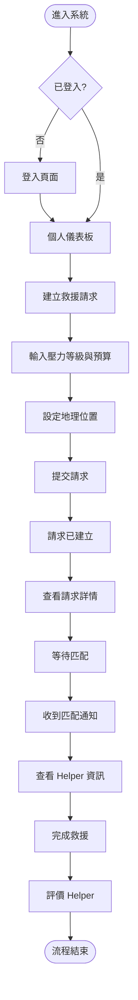

# 產品需求文件 (PRD) v1.0

> **版本**：v1.0  
> **建立日期**：2025  
> **目標讀者**：UIUX 設計師、產品管理師、前端/後端工程師  
> **文檔目的**：定義產品需求、設計規格與技術實作細節，平衡呈現設計與工程視角

---

## 目錄

1. [文檔概述](#文檔概述)
2. [背景簡介（產品目標）](#背景簡介產品目標)
3. [功能清單（Feature List）](#功能清單feature-list)
4. [功能分解圖（Functional Decomposition Diagram）](#功能分解圖functional-decomposition-diagram)
5. [功能流程圖（User Flows）](#功能流程圖user-flows)
6. [Site Map 與資訊架構（Site Map & Information Architecture）](#site-map-與資訊架構site-map--information-architecture)
7. [Wireframe 與 UI 規格（設計規格）](#wireframe-與-ui-規格設計規格)
8. [技術規格（工程規格）](#技術規格工程規格)
9. [MVP 決策記錄](#mvp-決策記錄)
10. [驗收標準（Acceptance Criteria）](#驗收標準acceptance-criteria)
11. [修訂追蹤表（Revision History）](#修訂追蹤表revision-history)

---

## 文檔概述

### 版本資訊
- **版本**：v1.0
- **建立日期**：2025
- **最後更新**：2025
- **維護者**：待指定

### 目標讀者
- **UIUX 設計師**：關注頁面布局、UI 區塊、互動流程、設計規範
- **產品管理師**：關注功能需求、用戶流程、優先級、驗收標準
- **前端/後端工程師**：關注技術規格、資料結構、API 設計、實作細節

### 文檔目的
本 PRD 旨在：
- 定義產品功能需求與業務邏輯
- 提供清晰的設計規格與 UI/UX 指引
- 提供完整的技術規格與實作細節
- 建立設計師與工程師的對齊基準
- 定義驗收標準與檢查清單

---

## 背景簡介（產品目標）

### 產品名稱
**節慶互助平台 - ORCA**

### 產品定位
協助用戶應對節慶期間的社交壓力，提供救援服務、應對工具、社群連結與自我診斷功能。

### 目標用戶
系統支援 5 種用戶角色，每種角色有不同的使用場景與需求：

| 用戶角色 | 英文名稱 | 主要需求 | 核心功能 |
|---------|---------|---------|---------|
| 焦慮的求助者 | Escapee | 需要即時救援與應對工具 | 建立救援請求、應對錦囊、角色診斷 |
| 專業的閒人 | Helper | 提供救援服務 | Helper 註冊、接案管理、業績統計 |
| 覺醒的長輩 | WokeElder | 了解溝通邊界 | 角色診斷（長輩端）、邊界說明書 |
| 夾心餅乾配偶 | SilentBuffer | 需要救援與應對工具 | 建立救援請求、應對錦囊、取暖牆 |
| 節慶自由人 | UrbanLoner | 尋找同溫層與聚會 | 發起/參與聚會、取暖牆 |

### 核心價值
1. **即時救援**：快速匹配 Helper，提供人力支援或空間導航
2. **應對工具**：生成應對腳本，協助用戶應對長輩問話
3. **社群連結**：取暖牆與聚會功能，尋找志同道合的夥伴
4. **自我診斷**：角色診斷工具，了解自己的社交模式與心理陰影面積

### 業務目標
- **Phase 1（MVP）**：驗證核心救援功能與 Helper 匹配機制
- **Phase 2**：擴展核心功能，增加用戶體驗
- **Phase 3**：增加診斷工具與視覺化功能
- **Phase 4**：個人社交邊界管理
- **長期目標**：建立節慶期間的互助生態系統

---

## 功能清單（Feature List）

> **完整功能清單**：詳細的功能清單包含 Phase 1-4 的完整功能描述、子功能與業務邏輯，請參考 [`feature-list.md`](./feature-list.md)

### 功能清單說明

功能清單按照開發階段（Phase）組織，每個 Phase 包含目標、功能項目與功能描述。

### Phase 摘要

**Phase 1（MVP - 最精簡核心）**：驗證核心救援功能與 Helper 匹配機制
- 認證系統：登入、註冊
- 救援功能（B1）：建立救援請求、救援請求詳情
- Helper 功能（B4）：Helper 註冊、Helper 儀表板
- 個人儀表板（簡化版）：用戶資訊、快速操作
- 通知系統（B7）：通知列表、篩選

**Phase 2（擴展核心功能）**：完善核心功能，增加用戶體驗
- 個人儀表板（完整版）：救援請求列表、聚會列表
- 個人資料管理：個人資料設定
- 通知系統擴展：通知設定
- 救援功能擴展：選擇 Helper
- Helper 功能擴展：Helper 檔案、Helper 設定
- 應對錦囊（B2）：腳本生成、顯示、收藏
- 取暖牆（B5）：貼文流、發起聚會、聚會管理

**Phase 3（診斷與地圖）**：增加診斷工具與視覺化功能
- 角色診斷（B3）：開始測驗、提交答案、診斷報告
- 實況地圖（B6）：地圖視覺化、圖層切換

**Phase 4（邊界管理）**：個人社交邊界管理
- 邊界說明書（B8）：編輯邊界、分享功能

> **詳細功能描述**：包含各功能的子功能列表、業務邏輯與用途說明，請參考 [`feature-list.md`](./feature-list.md)

---

## 功能分解圖（Functional Decomposition Diagram）

> **完整功能分解圖**：完整的功能分解圖包含所有 Level 1-3 的詳細分解、Mermaid 圖表、完整功能模組對照表等，請參考 [`functional-decomposition.md`](./functional-decomposition.md)

### FDD 說明

功能分解圖（Functional Decomposition Diagram, FDD）是一種將系統功能從高層到低層逐步分解的層次化圖表，用於：
- **理解系統架構**：清晰展示系統的功能模組與層次關係
- **規劃開發範圍**：識別功能模組的優先級與開發順序
- **溝通對齊**：幫助設計師與工程師理解功能結構與依賴關係

**閱讀方式**：
- **Level 0**：系統整體
- **Level 1**：主要功能模組（10 個核心功能區塊）
- **Level 2**：子功能（每個模組下的具體功能）
- **Level 3**：具體操作步驟（僅關鍵功能展開）

### Level 1：主要功能模組

系統包含以下 10 個核心功能模組：

1. **認證系統**（Authentication）- 用戶登入、註冊與個人資料管理
2. **救援功能**（Rescue, B1）- 建立救援請求、查看詳情、請求管理
3. **Helper 功能**（Helper, B4）- Helper 註冊、儀表板、接案管理
4. **個人儀表板**（Dashboard）- 用戶資訊顯示、快速操作、資料整合
5. **通知系統**（Notification, B7）- 通知列表、篩選、狀態管理
6. **應對錦囊**（Response Kit, B2）- 腳本生成、顯示、收藏
7. **取暖牆**（Venting, B5）- 貼文流、發起聚會、聚會管理
8. **角色診斷**（Diagnostic, B3）- 開始測驗、提交答案、診斷報告
9. **實況地圖**（Live Map, B6）- 地圖視覺化、圖層切換、地圖標記
10. **邊界說明書**（Boundary Manual, B8）- 編輯邊界、分享功能

### 功能模組對照表（摘要）

| 功能模組 | 優先級 | 狀態 |
|---------|--------|------|
| **認證系統** | P0 | Phase 1 |
| **救援功能** | P0 | Phase 1 |
| **Helper 功能** | P0 | Phase 1 |
| **個人儀表板** | P0 | Phase 1 |
| **通知系統** | P0 | Phase 1 |
| **個人儀表板擴展** | P1 | Phase 2 |
| **個人資料管理** | P1 | Phase 2 |
| **通知系統擴展** | P1 | Phase 2 |
| **救援功能擴展** | P1 | Phase 2 |
| **Helper 功能擴展** | P1 | Phase 2 |
| **應對錦囊** | P1 | Phase 2 |
| **取暖牆** | P1 | Phase 2 |
| **角色診斷** | P2 | Phase 3 |
| **實況地圖** | P2 | Phase 3 |
| **邊界說明書** | P2 | Phase 4 |

> **詳細資訊**：包含英文代碼、相關板塊、主要子功能等完整資訊，請參考 [`functional-decomposition.md`](./functional-decomposition.md) 中的完整對照表。

---

## 功能流程圖（User Flows）

> **詳細用戶流程**：完整的用戶流程圖包含所有 5 個用戶角色的詳細流程、BFF 路徑標註、錯誤處理流程等，請參考 [`user-flows.md`](./user-flows.md)

### 流程圖說明

用戶流程圖展示用戶在系統中完成特定任務的完整路徑，包括：
- **頁面導航**：用戶在各頁面間的移動路徑
- **決策點**：用戶需要做出選擇的關鍵節點
- **系統處理**：系統自動執行的操作

以下提供一個代表性的用戶流程範例：

### 範例流程：Escapee 建立救援請求

**關鍵決策點**：
- 登入狀態檢查
- 請求類型選擇（人力請求/空間導航/混合）
- Helper 匹配確認

**頁面路由**：
- `/login` → `/dashboard` → `/rescue-request/create` → `/rescue-request/[requestId]`

### 主要用戶流程對照表

| 用戶角色 | 主要流程 | 頁面路由 | 優先級 | Phase |
|---------|---------|---------|--------|-------|
| **Escapee** | 建立救援請求 | `/rescue-request/create` | P0 | Phase 1 |
| **Escapee** | 使用應對錦囊 | `/response-kit` | P1 | Phase 2 |
| **Escapee** | 角色診斷 | `/diagnostic` | P2 | Phase 3 |
| **Helper** | 註冊並接案 | `/helper/register` → `/helper/dashboard` | P0 | Phase 1 |
| **Helper** | 查看可接案件 | `/helper/dashboard` | P0 | Phase 1 |
| **UrbanLoner** | 發起聚會 | `/gathering/create` | P1 | Phase 2 |
| **UrbanLoner** | 參與聚會 | `/gathering/list` | P1 | Phase 2 |
| **UrbanLoner** | 查看實況地圖 | `/map` | P2 | Phase 3 |
| **WokeElder** | 角色診斷 | `/diagnostic` | P2 | Phase 3 |
| **WokeElder** | 查看邊界說明書 | `/boundary-manual` | P2 | Phase 4 |
| **SilentBuffer** | 建立請求+腳本 | `/rescue-request/create` + `/response-kit` | P0/P1 | Phase 1/2 |
| **SilentBuffer** | 取暖牆宣洩貼文 | `/venting` | P1 | Phase 2 |
| **所有角色** | 查看通知 | `/notifications` | P0 | Phase 1 |
| **所有角色** | 建立邊界說明書 | `/boundary-manual` | P2 | Phase 4 |

> **完整流程詳情**：包含所有角色的詳細流程圖、BFF 路徑標註、錯誤處理流程、決策點說明等，請參考 [`user-flows.md`](./user-flows.md)

---

## Site Map 與資訊架構（Site Map & Information Architecture）

> **詳細資訊架構**：完整的 Site Map（包含路由細節）、導航結構規劃、麵包屑設計、頁面列表、用戶角色導航差異等，請參考 [`information-architecture.md`](./information-architecture.md)

### Site Map 說明

Site Map 展示網站所有頁面的層次結構與組織方式，幫助理解整體頁面架構與功能模組關係。

#### 視覺化 Site Map

```mermaid
graph TD
    Home[首頁] --> Auth[認證系統 Phase1]
    Home --> Dashboard[個人儀表板 Phase1]
    Home --> Rescue[救援功能 B1 Phase1]
    Home --> Helper[Helper 功能 B4 Phase1]
    Home --> Notification[通知系統 B7 Phase1]
    Home --> ResponseKit[應對錦囊 B2 Phase2]
    Home --> Venting[取暖牆 B5 Phase2]
    Home --> Diagnostic[角色診斷 B3 Phase3]
    Home --> LiveMap[實況地圖 B6 Phase3]
    Home --> Boundary[邊界說明書 B8 Phase4]
    
    Auth --> Login[登入]
    Auth --> Register[註冊]
    
    Dashboard --> DashboardPage[個人儀表板]
    Dashboard --> Profile[個人資料]
    Dashboard --> Notifications[通知中心]
    
    Rescue --> CreateRequest[建立救援請求]
    Rescue --> RequestDetail[救援請求詳情]
    Rescue --> RequestMatch[選擇 Helper]
    
    Helper --> HelperRegister[Helper 註冊]
    Helper --> HelperProfile[Helper 檔案]
    Helper --> HelperSettings[Helper 設定]
    Helper --> HelperDashboard[Helper 儀表板]
    
    ResponseKit --> ResponseKitPage[應對錦囊]
    
    Venting --> VentingFeed[貼文流]
    Venting --> CreateGathering[發起聚會]
    Venting --> GatheringList[聚會列表]
    Venting --> GatheringDetail[聚會詳情]
    
    Diagnostic --> DiagnosticStart[開始測驗]
    Diagnostic --> DiagnosticReport[診斷報告]
    
    LiveMap --> MapPage[實況地圖]
    
    Boundary --> BoundaryManual[邊界說明書]
    Boundary --> BoundaryShare[分享頁]
    
    style Home fill:#e1f5ff
    style Auth fill:#fff4e1
    style Rescue fill:#ffe1e1
    style Helper fill:#e1ffe1
    style Dashboard fill:#f0e1ff
    style Notification fill:#ffe1f0
    style ResponseKit fill:#e1ffff
    style Venting fill:#ffffe1
    style Diagnostic fill:#e1e1ff
    style LiveMap fill:#ffe1ff
    style Boundary fill:#e1ffe1
```

> **完整 Site Map 內容**：包含頁面列表（24 個頁面）、頁面優先級摘要、導航結構、頁面組織架構、用戶角色導航差異等完整資訊，請參考 [`information-architecture.md`](./information-architecture.md)

---

## Wireframe 與 UI 規格（設計規格）

> **完整 Wireframe 與 UI 規格**：包含頁面布局類型（4 種模板）、UI 區塊對照表、設計規範（響應式斷點、組件使用規範、視覺層級）等完整內容，請參考 [`wireframes-v2.md`](./wireframes-v2.md)

### Wireframe 與 UI 規格說明

本文件定義產品的設計規格，包括頁面布局類型、UI 區塊設計與設計規範。

### 頁面布局類型摘要

系統定義了 4 種標準頁面模板：

1. **表單頁面模板**：適用於登入、註冊、建立請求等表單頁面
2. **詳情頁模板**：適用於救援請求詳情、Helper 詳情、聚會詳情等詳情頁
3. **儀表板模板**：適用於個人儀表板、Helper 儀表板等儀表板頁面
4. **列表頁模板**：適用於通知中心、取暖牆等列表頁面

### 設計規範摘要

- **響應式斷點**：手機版（< 768px）、平板版（768px - 1024px）、桌面版（> 1024px）
- **組件使用**：基礎組件（Button、Card、Input 等）與業務組件（RescueRequestCard、HelperCard 等）
- **視覺層級**：主要資訊、次要資訊、操作按鈕、狀態標示的視覺層級規範

> **完整 Wireframe 與 UI 規格**：包含頁面總覽表、頁面模板、功能模組詳細規格、UI 區塊對照表、設計規範、互動流程摘要等完整內容，請參考 [`wireframes-v2.md`](./wireframes-v2.md)

---

## 技術規格（工程規格）

> **完整技術規格**：包含頁面路由設計、資料需求與頁面複雜度、前端架構等完整技術實作細節，請參考 [`technical-specs.md`](./technical-specs.md)

### 技術規格說明

> **設計師友善說明**：本節提供技術實作細節，供工程師參考。設計師可重點關注「資料需求」與「頁面複雜度」部分，了解頁面的資料載入策略與 UX 影響。

### 技術規格摘要

**頁面路由設計**：
- 路由命名規則：嚴格使用 `kebab-case`，不超過 3 層嵌套
- 路由守衛規則：認證守衛、角色守衛、資源擁有者守衛

**資料需求與頁面複雜度**：
- **Simple (1:1)**：一個頁面對應一個資料來源（如登入頁、應對錦囊頁）
- **Standard (1:2-3)**：一個頁面對應 2-3 個資料來源（如救援請求詳情、Helper 詳情）
- **Complex (1:N)**：一個頁面對應多個獨立資料來源（如個人儀表板、Helper 儀表板）

**前端架構**：
- Hooks 設計：命名規範 `use[PageContext][Resource]()`，使用 Nuxt 3 的 `useFetch` 或 `useAsyncData`
- 組件庫規劃：基礎組件、業務組件、布局組件、表單組件

> **詳細技術細節**：包含完整的路由設計、資料需求對照表、Hooks 設計範例等，請參考 [`technical-specs.md`](./technical-specs.md)  
> **相關文檔**：BFF 路徑設計請參考 [`docs/construction/bff-paths.md`](../construction/bff-paths.md)，資料需求請參考 [`docs/construction/data-requirements.md`](../construction/data-requirements.md)

---

## MVP 決策記錄

> **詳細決策記錄**：完整的 MVP 決策記錄包含所有關鍵技術決策、決策原則、功能範圍限制等，請參考 [`mvp-decisions.md`](./mvp-decisions.md)

### MVP 決策說明

MVP 決策記錄包含產品開發過程中的關鍵技術決策與功能範圍限制。

### 決策分類摘要

**對象層級決策**：
- User 與 Helper 一對一關係（Phase 1/MVP 階段）
- RescueRequest 一對一自動匹配
- VentPost 可選關聯 Gathering

**功能層級決策**：
- ResponseScript 預先定義（不依賴 AI 生成）
- 診斷報告私密連結分享（使用 token 機制）

**BFF 聚合決策**：
- 資料載入策略：聚合策略 vs 獨立載入策略
- 頁面複雜度判斷：Simple / Standard / Complex

### 決策原則

優先選擇施工難度較低的方案，符合 MVP 快速迭代需求。

### 功能範圍限制摘要

- **Phase 1（MVP）**：僅包含核心救援功能與 Helper 匹配機制
- **Phase 2**：擴展核心功能，實作應對錦囊與取暖牆
- **Phase 3**：實作角色診斷與實況地圖
- **Phase 4**：實作邊界說明書

> **完整決策記錄**：包含所有決策的詳細理由與影響範圍，請參考 [`mvp-decisions.md`](./mvp-decisions.md)

---

## 驗收標準（Acceptance Criteria）

> **完整驗收標準**：完整的驗收標準包含所有功能、設計與技術的詳細檢查清單，請參考 [`acceptance-criteria.md`](./acceptance-criteria.md)

### 驗收標準說明

驗收標準（Acceptance Criteria）是產品開發過程中用於驗證功能、設計與技術實作是否符合需求的檢查清單，包含三大類驗收標準：

- **功能驗收標準**：驗證各功能模組是否符合業務需求與用戶需求
- **設計驗收標準**：驗證 UI/UX 設計是否符合設計規範與用戶體驗要求
- **技術驗收標準**：驗證技術實作是否符合架構設計與工程規範

### 驗收標準分類摘要

#### 功能驗收標準

涵蓋以下功能模組的驗收項目：
- **認證系統**：登入、註冊、錯誤處理、導航、Token 儲存
- **救援功能（B1）**：建立請求、請求詳情、Helper 匹配、通知發送
- **Helper 功能（B4）**：Helper 註冊、儀表板、狀態切換、接受請求
- **個人儀表板**：用戶資訊、快速操作、列表顯示、載入狀態
- **通知系統（B7）**：通知列表、篩選功能、標記已讀、導航

#### 設計驗收標準

涵蓋以下驗收項目：
- **UI/UX 驗收**：設計規範符合度、響應式設計、載入狀態、錯誤狀態、互動反饋
- **組件使用驗收**：組件庫規範、組件狀態、無障礙性

#### 技術驗收標準

涵蓋以下驗收項目：
- **BFF 路徑驗收**：命名規範、頁面複雜度分類、資料聚合策略、錯誤處理
- **資料結構驗收**：TypeScript 介面定義、資料驗證、資料載入策略
- **前端架構驗收**：Hooks 命名、組件結構、路由守衛、錯誤處理

### 驗收流程建議

1. **開發階段**：開發人員在實作功能時，參考對應的驗收標準進行自檢
2. **測試階段**：測試人員根據驗收標準編寫測試用例並執行測試
3. **驗收階段**：產品管理師、設計師與工程師共同檢查，逐項確認完成度
4. **追蹤記錄**：在專案管理工具中追蹤每個驗收項目的完成狀態

> **詳細檢查清單**：包含所有驗收項目的完整檢查清單（約 50+ 項），請參考 [`acceptance-criteria.md`](./acceptance-criteria.md)

---

## 修訂追蹤表（Revision History）

| 版本 | 日期 | 修改內容 | 修改者 |
|------|------|---------|--------|
| v1.0 | 2025 | 初始版本建立 | 待指定 |

---

## 附錄

### 相關文檔索引

#### PRD 相關文檔
- **功能清單**：[`feature-list.md`](./feature-list.md) - Phase 1-4 的完整功能清單
- **功能分解圖**：[`functional-decomposition.md`](./functional-decomposition.md) - 完整的功能分解圖與功能模組對照表
- **用戶流程**：[`user-flows.md`](./user-flows.md) - 完整的用戶流程圖與 BFF 路徑標註
- **資訊架構與 Site Map**：[`information-architecture.md`](./information-architecture.md) - 完整的 Site Map（包含路由細節）、導航結構規劃、麵包屑設計
- **Wireframe 與 UI 規格**：[`wireframes-v2.md`](./wireframes-v2.md) - 頁面總覽表、頁面模板、功能模組詳細規格、UI 區塊對照表、設計規範、互動流程摘要
- **技術規格**：[`technical-specs.md`](./technical-specs.md) - 頁面路由設計、資料需求與頁面複雜度、前端架構
- **驗收標準**：[`acceptance-criteria.md`](./acceptance-criteria.md) - 功能、設計與技術的完整驗收標準檢查清單
- **MVP 決策記錄**：[`mvp-decisions.md`](./mvp-decisions.md) - 完整的 MVP 決策記錄與決策原則

#### 其他相關文檔
- **ORCA 分析文檔**：[`docs/orca/orca-analysis-v1.md`](../orca/orca-analysis-v1.md)
- **BFF 路徑設計**：[`docs/construction/bff-paths.md`](../construction/bff-paths.md)
- **資料需求**：[`docs/construction/data-requirements.md`](../construction/data-requirements.md)
- **頁面路由設計**：[`docs/construction/page-routes.md`](../construction/page-routes.md)
- **前端 Hooks**：[`docs/construction/frontend-hooks.md`](../construction/frontend-hooks.md)
- **組件庫規劃**：[`docs/component-library.md`](../component-library.md)

---

**文檔版本**：v1.0  
**最後更新**：2025  
**維護者**：待指定

